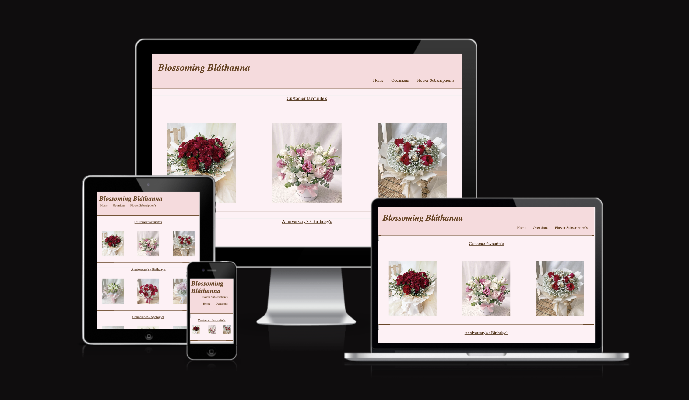
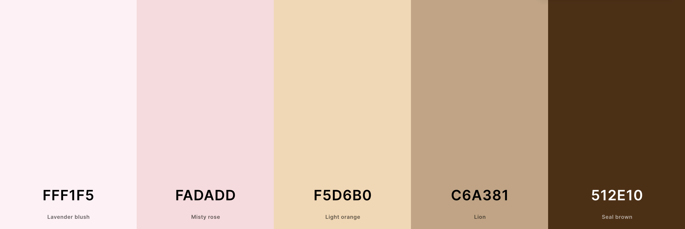
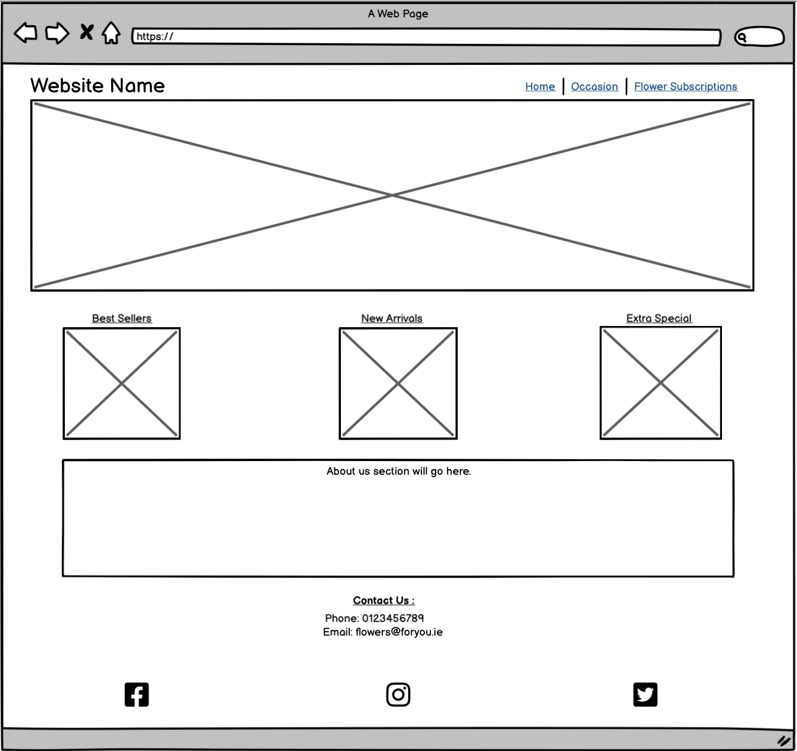
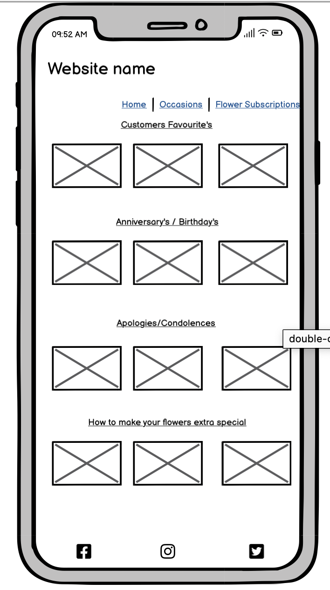
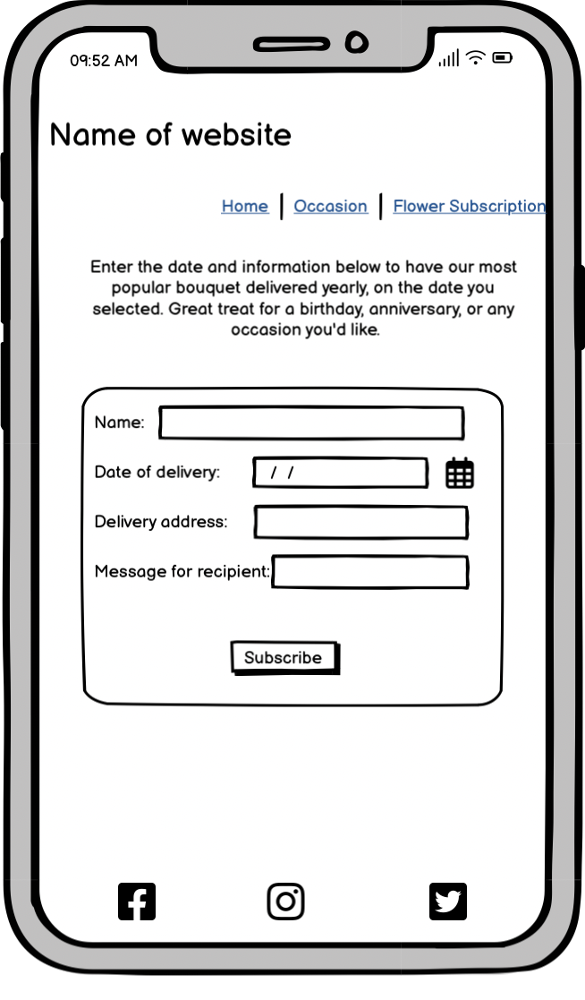
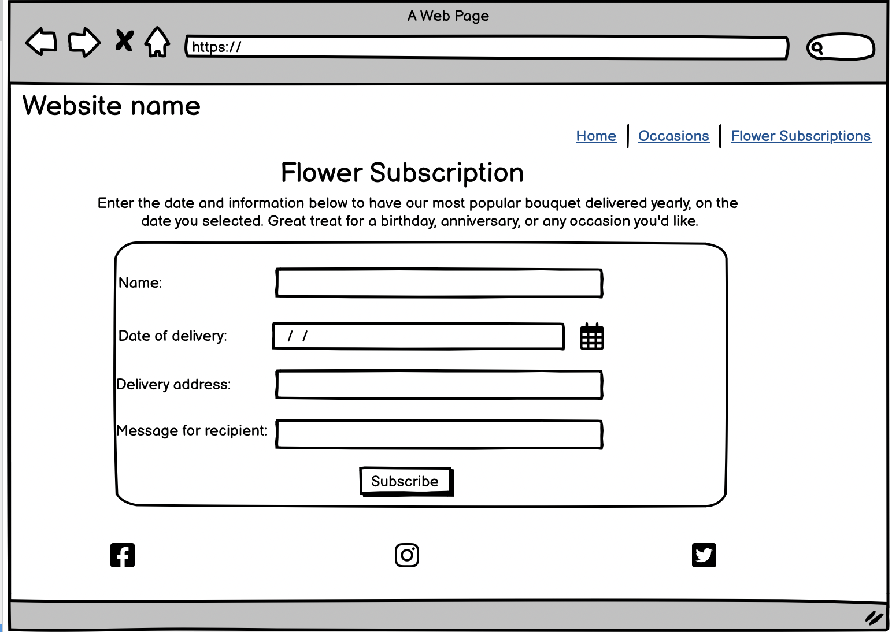
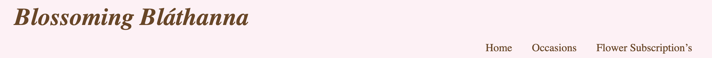
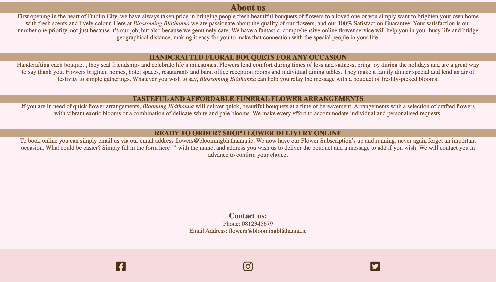
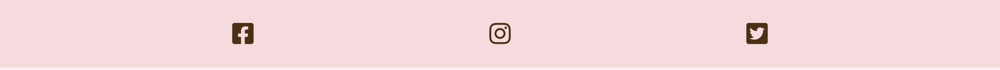
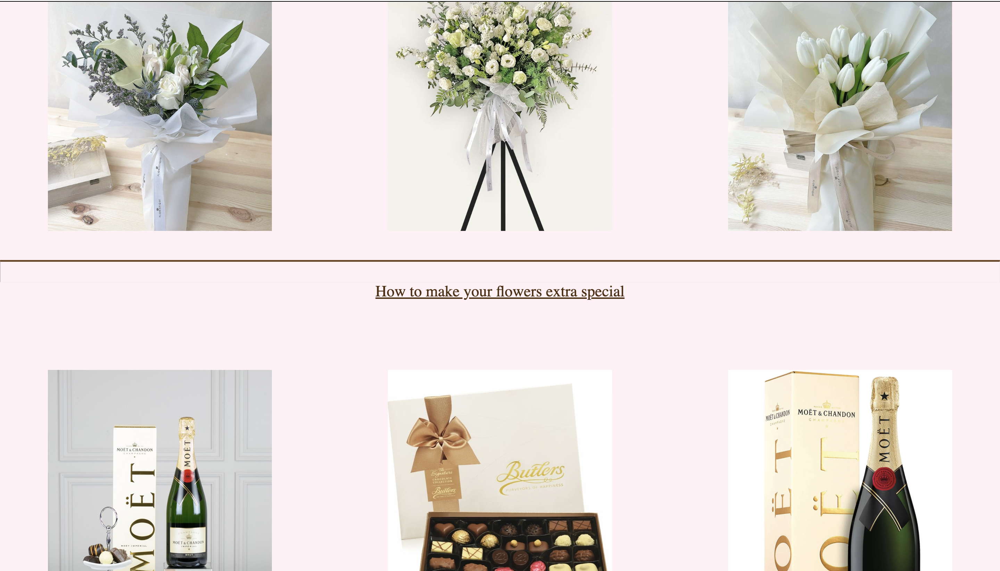

# Blossoming Bláthanna

Blossoming Bláthanna is an irish owned florist based in the capital city of Ireland, Dublin. Proud to be an Irish grown business , we have our native language in the name. Bláthanna meaning flowers in Irish. With our aim to bring a complete online flower service to customers with the option of having a flower subscription to have flowers delivered to you or a loved one on a date you choose, continuously. This being a website the customer can view images of bouquets, customers favourites and even add on some extras to go with their flowers if needs be. Contact can be made by emailing, calling or simply by signing up to our subscription page.

Here's my deployed site as an example:
https://ui.dev/amiresponsive?url=https://shellym96.github.io/project1

## UX

This website was thought of to be colorful and visually appealing to the customer. Spacious enough that it isn't overwhelming for the viewer, but isn't too plain to loose interest. 

While being easy to navigate for any age or device you are on. The hover effect over the titles and images, then having links added to some images and text for other pages of the website , making it easier again for the customer to access parts of the website without having to go out of their way too look for what they need.

### Colour Scheme
I decided to go with these colours , to have a fun, light side to the website , all while having a mature feel with the dark brown writing. Nothing too gloomy as for a florist website it should be colourful, which is why I went with a dark brown instead of your typical black.

- `#512E10` used for primary text.
- `#C6A381` used for primary background highlights of text.
- `#FFF1F5` used for background colour.
- `#FADADD` used for highlights of header and subscription form.

I used Coolers ' https://coolors.co/fff1f5-fadadd-f5d6b0-c6a381-512e10 ' to generate my colour palette.

### Typography

I used fontpair to find the perfect font for my website, and I chose the font named Forum. As it has a classic roman times look.

I then used fontawesome for my icons. As I just have icons in the footer for social media.

- [Forum](https://www.fontpair.co/fonts/forum) was used for the entirety of the text.

- [Font Awesome](https://fontawesome.com) icons were used throughout the site, such as the social media icons in the footer.

## Wireframes

To follow best practice, wireframes were developed for mobile, tablet, and desktop sizes.
I've used [Balsamiq](https://balsamiq.com/wireframes) to design my site wireframes.

### Home Page Wireframes

| Size | Screenshot |
| --- | --- |
| Desktop |  |

### Occasions Page Wireframes

| Size | Screenshot |
| --- | --- |
| Mobile |  |

### Flower Subscriptions Page Wireframes

| Size | Screenshot |
| --- | --- |
| Mobile |  |
| Desktop |  |

## Features

There are three featured pages on this site to make it easy for the customer to navigate through.

With a hover effect over titles and images to have them viewed more easily, while having links from images to different pages on the site to direct the consumer to the correct page, due to the title or image they click.

### Existing Features

- **Navigation bar**
    - The navigation bar is fully responsive, you can click the Blossoming Bláthanna header and it will lead you back to the home page as well as the 'home'. 
* The navigation bar looks the exact same on all devices;
    * Desktop
    * Tablet
    * Mobile
which makes it less confusing for returning customers.

- **Home Page**

    - The homepage consists of different tones of light pink paired with a bold dark brown to make some contrast, alongside some light brown.
        * The hero image is an image of a florist at work on their table surrounded by beautiful flowers.
      * As you begin to scroll down the page you come to three images picked to catch the eye of the cusomter, with a hover:zoom effect on both image and title above. 
         * Continuing to scroll, you will come to our About us section that is filled with information the consumer may be looking for with our contact information also present below.

- **About Us**
    * Full of information on the business itself, how and where it began. 
    * Our goals , our service and what we want to bring to the customer.
* While being full of information, still showing the customer that they come first and we want to make sure that they know we value their precious time.

- **Footer**

    - Icons with links to social medias.
        * Facebook
        * Instagram
        * Twitter
Each bring customer to a separate tab when clicked , so they dont loose access to our website.

- **Occasions Page**

    * Four sections full of different images of various bouquets , each suitable to different occasions.
    * Each has a seperate header to suit the images and occasion.
    * Three images with hover:zoom effect in place per section.
    * Contact us information placed at the bottom of the screen above the footer for quick access.

    
    

- **Flower Subscriptions Page**
    * An interactive subscriptions page which gives you options of 
        * Name
        * Delivery address
        * Date of Delivery
        * Message which is optional
    * All are required except the message box, which pops up below the text field if customer tries to submit without filling them in. 
    * Contact us information palces at the bottom of the subscription box again for quick access.

    

### Future Features

- Design above and below about us section.
    * I orginally would have liken to add big curly braces on top and below the about us section rather than have the lines straight through.
- A logo for the header instead of text.

## Tools & Technologies Used

- [HTML](https://en.wikipedia.org/wiki/HTML) used for the main site content.
- [CSS](https://en.wikipedia.org/wiki/CSS) used for the main site design and layout.
- [CSS Flexbox](https://www.w3schools.com/css/css3_flexbox.asp) used for an enhanced responsive layout.
- [CSS Grid](https://www.w3schools.com/css/css_grid.asp) used for an enhanced responsive layout.
- [Git](https://git-scm.com) used for version control. (`git add`, `git commit`, `git push`)
- [GitHub](https://github.com) used for secure online code storage.
- [GitHub Pages](https://pages.github.com) used for hosting the deployed front-end site.
- [Gitpod](https://gitpod.io) used as a cloud-based IDE for development.
- [Balsamiq](https://balsamiq.com/wireframes/desktop/#) to create wireframes.
- [fontpair](https://www.fontpair.co/all) to pick my font.
- [fontawesome](https://fontawesome.com/) to pick choose my icons.
- [Am I Responsive](https://ui.dev/amiresponsive) for my own mockups on various screen sizes.

## Testing

For all testing, please refer to the [TESTING.md](TESTING.md) file.

## Deployment

The site was deployed to GitHub Pages. The steps to deploy are as follows:
- In the [GitHub repository](https://github.com/shellym96/project1), navigate to the Settings tab 
- From the source section drop-down menu, select the **Main** Branch, then click "Save".
- The page will be automatically refreshed with a detailed ribbon display to indicate the successful deployment.

The live link can be found [here](https://shellym96.github.io/project1)

### Local Deployment

This project can be cloned or forked in order to make a local copy on your own system.

#### Cloning

You can clone the repository by following these steps:

1. Go to the [GitHub repository](https://github.com/shellym96/project1) 
2. Locate the Code button above the list of files and click it 
3. Select if you prefer to clone using HTTPS, SSH, or GitHub CLI and click the copy button to copy the URL to your clipboard
4. Open Git Bash or Terminal
5. Change the current working directory to the one where you want the cloned directory
6. In your IDE Terminal, type the following command to clone my repository:
	- `git clone https://github.com/shellym96/project1.git`
7. Press Enter to create your local clone.

Alternatively, if using Gitpod, you can click below to create your own workspace using this repository.

Please note that in order to directly open the project in Gitpod, you need to have the browser extension installed.
A tutorial on how to do that can be found [here](https://www.gitpod.io/docs/configure/user-settings/browser-extension).

#### Forking

By forking the GitHub Repository, we make a copy of the original repository on our GitHub account to view and/or make changes without affecting the original owner's repository.
You can fork this repository by using the following steps:

1. Log in to GitHub and locate the [GitHub Repository](https://github.com/shellym96/project1)
2. At the top of the Repository (not top of page) just above the "Settings" Button on the menu, locate the "Fork" Button.
3. Once clicked, you should now have a copy of the original repository in your own GitHub account!

## Credits

All of the websites and pages below were used to help build this project for educational purposes only.

### Content
The table below holds links and names to websites I have used to help build this website : 

| Source | Location | Notes |
| --- | --- | --- |
| [Markdown Builder](https://traveltimn.github.io/markdown-builder) | README and TESTING | tool to help generate the Markdown files |
| [W3Schools](https://www.w3schools.com/howto/howto_css_image_overlay.asp) | entire site | to help add hover effect on images/text|
| [W3Schools](https://www.w3schools.com/howto/howto_js_topnav_responsive.asp) | entire site | responsive HTML/CSS|
| [Flexbox Froggy](https://flexboxfroggy.com/) | entire site | modern responsive layouts |

### Media

Below are links and names to websites I have chosen my images from. I decided to use the same website for my bouquet images to keep familarity among the website. 

| Source | Location | Type | Notes |
| --- | --- | --- | --- |
| [Floristique](https://www.floristique.sg/) | entire site | image | bouquet images|
| [Butlers Chocolates](https://www.butlerschocolates.com/en) | occasions| image | box of chocolates |
| [thenudewineco](https://thenudewineco.ie/) | occassions | image | bottle of moet with gold box |
| [erinhampers](https://erinhampers.com/) | home page | image | moet champange and stand of chocolates |
| [erinhampers](https://erinhampers.com/) | occasions | image | moet champange and stand of chocolates |

### Acknowledgements

- First of all I want to say a huge thank you to my mentor [Tim Nelson](https://github.com/TravelTimN) . Since the start he has been a huge help, and support for me during this project. Giving me the confidence to proceed through and assuring me I'll get there! 
- I would like to thank the [Code Institute Slack community](https://code-institute-room.slack.com) . The support I recieved from my fellow course members really pushed me to keep going, knowing we were doing this together.

