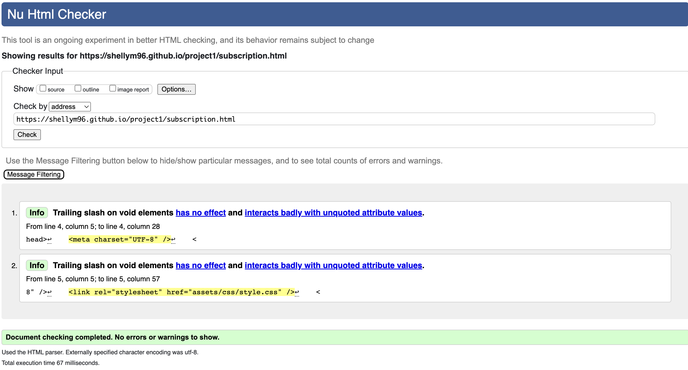
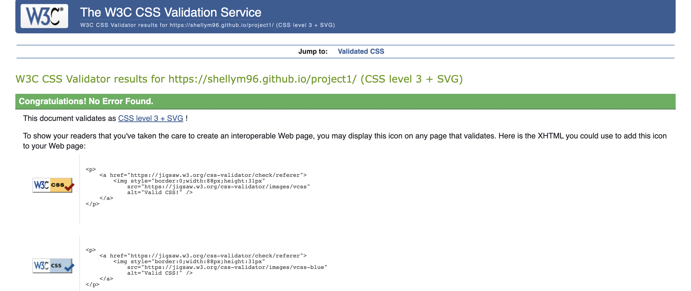

# Testing

Return back to the [README.md](README.md) file.

## Version Control / Commit Messages

I'm fully aware that some of my commit messages are not up to standard, and that's because I was following along with the Code Institute lessons and tutorials. After speaking with my mentor, I now know the best practices for writing commit messages, and will proceed to use this new knowledge going forward with my future projects.

## Code Validation

### HTML

I have used the recommended [HTML W3C Validator](https://validator.w3.org) to validate all of my HTML files.

| Page | W3C URL | Screenshot | Notes |
| --- | --- | --- | --- |
| Home | [W3C](https://validator.w3.org/nu/?doc=https%3A%2F%2Fshellym96.github.io%2Fproject1%2Findex.html) |  | Pass - no errors or warnings to show|
| Occasions | [W3C](https://validator.w3.org/nu/?doc=https%3A%2F%2Fshellym96.github.io%2Fproject1%2Foccasions.html) |  | Pass - no errors or warnings to show|
| Flower Subscriptions | [W3C](https://validator.w3.org/nu/?doc=https%3A%2F%2Fshellym96.github.io%2Fproject1%2Fsubscription.html) |  | Pass - no errors or warnings to show|

### CSS

I have used the recommended [CSS Jigsaw Validator](https://jigsaw.w3.org/css-validator) to validate all of my CSS files.

| File | Jigsaw URL | Screenshot | Notes |
| --- | --- | --- | --- |
| style.css | [Jigsaw](https://jigsaw.w3.org/css-validator/validator?uri=https%3A%2F%2Fshellym96.github.io%2Fproject1) |  | Pass: No Errors or warnings to show |

## Browser Compatibility

I've tested my deployed project on multiple browsers to check for compatibility issues.
Everything remained the same, the way it was intended.

| Browser | Screenshot | Notes |
| --- | --- | --- |
| Safari |  | Works perfectly |
| Opera |  | Works perfectly |
| Chrome|  | Works perfectly |
| Firefox |  | Works perfectly |
| Internet Explorer | | Was retired June 15th 2022 |

## Lighthouse Audit

I've tested my deployed project using the Lighthouse Audit tool to check for any major issues.

| Page | Size | Screenshot | Notes |
| --- | --- | --- | --- |
| Home | Desktop |  | all high greens, except SEO  |
| Occasions | Desktop |  | all high greens, except SEO  |
| Subscriptions | Desktop |  | all high greens, except SEO |

### GitHub **Issues**

**Fixed Bugs**

All previously closed/fixed bugs can be tracked [here](https://github.com/shellym96/project1/issues?q=is%3Aissue+is%3Aclosed).

| Bug | Status |
| --- | --- |
| Social media icons wouldn't seperate as I had intended, tried different code to fix the problem. Doubled checked to see spelling was wrong on the class.| Closed |
| Occasion images would not go to size and when changed they would go vertical. When I found a way to make them horizontal they would have no space. Tried margin and padding, with no luck. Found grid to fix issue. | Closed |
| W3C, had testing issues. Errors of duplicate attributes, unclosed a attributes with extra closing div. All resolved. | Closed |

There are no remaining bugs that I am aware of.

